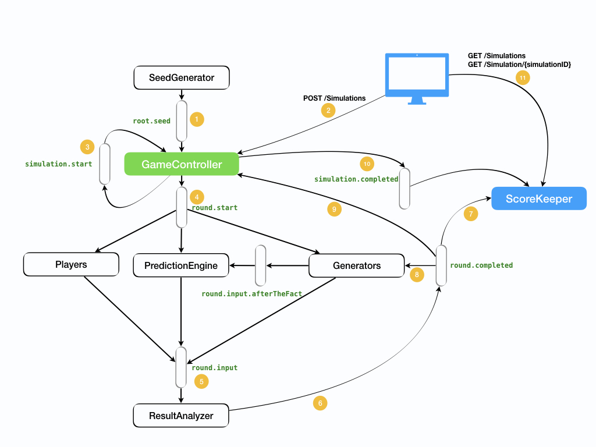

# (Java | Kafka | Spring) Assignment

### Application Diagram

1.  **SeedGenerator** is initiated during application startup and it will generate seed and put it in Kafka topic **"root.seed"** every 1 second (configurable in application.properties). **GameController** will receive this seed and use it when the time comes to start a new simulation round.
2.  **GeneratorController** will receive an API call "POST /Simulation" to run a new simulation. This API call will contain simulation settings: (numberOfSeasons, intervalBetweenSeasons, numberOfRounds, intervalBetweenRounds).
3.  **GeneratorController** will construct SimulationStart message and put it in Kafka topic **"simulation.start"**, this topic will be consumed by the GameController itself.
4.  **GeneratorController** will construct RoundStart message and put it in Kafka topic **"round.start"**.
5.  **Generators, Players and PredictionEngine** are listening to **"round.start"** and once they receive round start message, they will will generate guess/input and put it in Kafka topic **"round.input"**
6.  **ResultAnalyzer** will receive all inputs from Kafka topic **"round.input"** and will calculate the round score then declare the round completed by putting a message in **"round.completed"**.
7.  **ScoreKeeper** will receive the result from Kafka topic **"round.completed"**. **ScoreKeeper** will calculate cumulative score for each player, this cumulative score can be retrieved using **GET /simulations** . It will also store all rounds results which include (inputs from generators, estimates from players, score round for each player), this information can be retrieved using **GET /simulations/{simulationId}**. 
8.  **Generators** will share their inputs with the **PredictionEngine** through Kafka topic **"round.input.afterTheFact"** once the round is completed, **PredictionEngine** will store this data and use it later to generate estimates for future rounds.
9.  **GameController** will start the next round/season (or end the simulation if no more rounds/seasons) once it receives the **"round.completed""** message. **GameController** will also take care of adding the delay between rounds/seasons.
10. **GameController** will declare the simulation completed and put a message in Kafka topic **"simulation.completed"** if no more rounds/seasons left.
11. **ScoreKeeper** will receive an API call "GET /Simulations" or "GET /Simulation/{simulationId}" to retrieve simulation data. 
 
Notes:

- **Number of players** is configurables in application.properties
- **Seed Inerval** is configurables in application.properties

